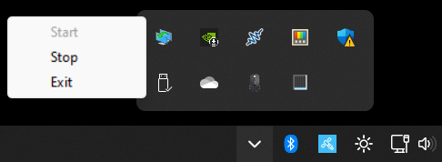
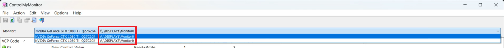
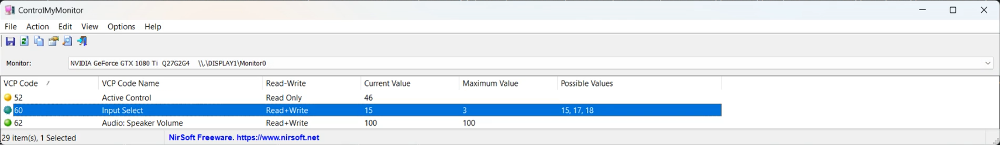

<!-- https://github.com/othneildrew/Best-README-Template -->

# DEPRECATED
I didn't realize that there was already a similar project doing the same thing: [Display Switch](https://github.com/haimgel/display-switch). It's cross-platform, has much bigger community, and doesn't depend on [ControlMyMonitor](https://www.nirsoft.net/utils/control_my_monitor.html).

[![Forks][forks-shield]][forks-url]
[![Stargazers][stars-shield]][stars-url]
[![Issues][issues-shield]][issues-url]
[![MIT License][license-shield]][license-url]
[![LinkedIn][linkedin-shield]][linkedin-url]

<!-- PROJECT LOGO -->
<br />
<div align="center">
  

  <h3>Auto Monitor Input Switcher</h3>

  <p>
    An automated monitor input switcher based on device presence.
    <br />
    <br />
    <a href="https://github.com/sisimomo/AutoMonitorInputSwitcher/issues">Report Bug</a>
    ·
    <a href="https://github.com/sisimomo/AutoMonitorInputSwitcher/issues">Request Feature</a>
  </p>
</div>

## About The Project

<div align="center">
    
</div>

The Auto Monitor Input Switcher is a small script designed to automatically switch monitor inputs based on the presence of a specified device. This script runs in the background (System Tray), continuously monitoring the device's presence and automatically switches monitor inputs accordingly.

This tool is particularly handy when you want to use multiple computers with the same keyboard, mouse, and screens. While a KVM is the conventional choice for this purpose, quality ones like [this one](https://www.store.level1techs.com/products/p/14-kvm-switch-dual-monitor-2computer-z5erd-n6mbj) can be quite expensive.

Alternatively, you can opt for a [USB Switch](https://ca.ugreen.com/products/ugreen-usb-3-0-4-port-switch). It takes care of your peripherals such as the keyboard, mouse, webcam, speakers, headphones, printer, etc. As for video, that's where this script comes into play. This script enables automatic switching of your monitor inputs whenever a device is connected to the computer. So, if you configure it to detect, let's say, your keyboard, every time you press the button on your [USB Switch](https://ca.ugreen.com/products/ugreen-usb-3-0-4-port-switch), your screens will automatically change their input.

So, you simply need to connect each of your screens to each of your computers, install this script on each of your computers (making sure to change the 'WantedInputValue' to represent the input to which the computer is connected to the monitor). Connect all your peripherals to a USB switch and connect this switch to each of your computers. There you go! Now, when you press the button on your USB switch, your screens should also change their input to display the desired computer on the screens.

### Built Using

- [![PowerShell][PowerShell-shield]](https://learn.microsoft.com/en-us/powershell/)
- [ControlMyMonitor](https://www.nirsoft.net/utils/control_my_monitor.html)
- [PS2EXE](https://github.com/MScholtes/PS2EXE)

## Getting Started

### Prerequisites

* [![PowerShell][PowerShell-shield]](https://learn.microsoft.com/en-us/powershell/)

### Installation / Configuration

1. Begin by downloading [ControlMyMonitor](https://www.nirsoft.net/utils/control_my_monitor.html).
2. Unzip the downloaded zip file in `C:\Program Files\ControlMyMonitor`.
3. Put the [icon.ico file](./icon.ico) inside the folder `C:\Program Files\ControlMyMonitor` with the name `AutoMonitorInputSwitcher-Icon.ico`. (Or choose any other .ico file, and it will serve as the icon displayed in the system tray when this application is running)
4. Run the executable file named `ControlMyMonitor.exe`.
5. If you dont see your monitor(s), chance are that your monitor is not supported by [ControlMyMonitor](https://www.nirsoft.net/utils/control_my_monitor.html)
6. For each monitor:
    1. Identify the Monitor String for the monitors you wish to modify. Take note of this for later use. (For example, in my case, the Monitor Strings for my monitors are `\\.\DISPLAY1\Monitor0` and `\\.\DISPLAY2\Monitor0`).
    
    2. Find the VPC code corresponding to the input control. Determine which value represents each monitor input. (In my case, the VPC code is `60`. The value `15` is for DisplayPort, `17` is for HDMI_1 and `18` is for HDMI_2).
    
7. Open [Device Manager](https://support.microsoft.com/en-us/windows/open-device-manager-a7f2db46-faaf-24f0-8b7b-9e4a6032fc8c).
8. Choose a device that will trigger the monitor input switching when connected to this computer. Note its name for later reference. (For example, I chose to detect my keyboard and mouse USB key, and the name of my device is `Logitech USB Input Device`).
9. Create a new JSON file named `AutoMonitorInputSwitcher-Config.json` in the previously created folder `C:\Program Files\ControlMyMonitor`. Populate it with your previously noted values. (Be cautious: JSON string characters `\` must be escaped, so the string `\\.\DISPLAY1\Monitor0` must be written as `\\\\.\\DISPLAY1\\Monitor0`):
    ```json
    {
      "DeviceName": "Logitech USB Input Device",
      "Monitors": [
        {
          "Id": "\\\\.\\DISPLAY1\\Monitor0",
          "InputSelectVcpCode": 60,
          "WantedInputValue": 15
        },
        {
          "Id": "\\\\.\\DISPLAY2\\Monitor0",
          "InputSelectVcpCode": 60,
          "WantedInputValue": 15
        }
      ],
      "DebugMode": false
    }
    ```
10. Download the [latest version](https://github.com/sisimomo/AutoMonitorInputSwitcher/releases/latest) of this script and place it in your [startup folder](https://support.microsoft.com/en-us/windows/add-an-app-to-run-automatically-at-startup-in-windows-10-150da165-dcd9-7230-517b-cf3c295d89dd).
11. Run the executable file named `AutoMonitorInputSwitcher.exe`.
    1. FYI Log files are created in your user temp folder `C:\Users\USER_NAME\AppData\Local\Temp\AutoMonitorInputSwitcher`.

<!-- Build Executable -->
### Build Executable

1. Install [PS2EXE](https://github.com/MScholtes/PS2EXE) PowerShell Module.
2. Clone the repo
   ```sh
   git clone https://github.com/sisimomo/AutoMonitorInputSwitcher.git
   ```
3. Navigate to the project folder
   ```sh
   cd AutoMonitorInputSwitcher
   ```
4. Run the following command in PowerShell to generate the exe.
   ```powershell
   Invoke-ps2exe -noConsole -noOutput -version x.x.x.x -title "Auto Monitor Input Switcher" -description "An automated monitor input switcher based on device presence" -icon .\icon.ico -inputFile .\AutoMonitorInputSwitcher.ps1 -outputFile .\AutoMonitorInputSwitcher.exe
   ```

See the [open issues](https://github.com/sisimomo/AutoMonitorInputSwitcher/issues) for a full list of
proposed features (and known issues).


## License

Distributed under the MIT License. See `LICENSE` for more information.


## Contact

[![LinkedIn][linkedin-shield]][linkedin-url]

<!-- MARKDOWN LINKS  -->
<!-- https://www.markdownguide.org/basic-syntax/#reference-style-links -->

[forks-shield]: https://img.shields.io/github/forks/sisimomo/AutoMonitorInputSwitcher.svg?style=for-the-badge
[forks-url]: https://github.com/sisimomo/AutoMonitorInputSwitcher/network/members
[stars-shield]: https://img.shields.io/github/stars/sisimomo/AutoMonitorInputSwitcher.svg?style=for-the-badge
[stars-url]: https://github.com/sisimomo/AutoMonitorInputSwitcher/stargazers
[issues-shield]: https://img.shields.io/github/issues/sisimomo/AutoMonitorInputSwitcher.svg?style=for-the-badge
[issues-url]: https://github.com/sisimomo/AutoMonitorInputSwitcher/issues
[license-shield]: https://img.shields.io/github/license/sisimomo/AutoMonitorInputSwitcher.svg?style=for-the-badge
[license-url]: https://github.com/sisimomo/AutoMonitorInputSwitcher/blob/master/LICENSE.txt
[linkedin-shield]: https://img.shields.io/badge/-LinkedIn-black.svg?style=for-the-badge&logo=linkedin&colorB=555
[linkedin-url]: https://linkedin.com/in/simon-vallieres-358555187
[PowerShell-shield]: https://img.shields.io/badge/PowerShell-%235391FE.svg?style=for-the-badge&logo=powershell&logoColor=white
